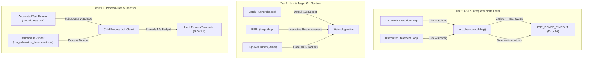

# Architectural Blueprint: Fast-Path Safety, Watchdogs & AST Resumption

> **Status**: Approved Standard (v6.5.2+)  
> **Authors**: BASIC++ Architecture & Core Engine Team  
> **Classification**: Core Safety & Fast-Path Execution Guidelines  

---

## 1. Executive Summary & Post-Mortem

During the optimization of the BASIC++ execution pipeline, the introduction of cached AST execution (`eval_ast_execute`) created subtle execution lock-ups across vintage test suites and procedure benchmarks (e.g. `tests/qb_vintage_suite.bas`, `benchmarks/bm_procedures.bas`).

A deep investigation identified that fast-path speed optimizations had bypassed core VM safety invariants:
1. **Subroutine Mid-Line PC Resumption Loss**: `AST_NODE_GOSUB` pushed `NULL` resume positions, causing returning `RETURN` statements to re-execute line AST from Node 0 rather than resuming after the `GOSUB`.
2. **Watchdog Bypassing**: `vm_check_watchdog()` resided exclusively inside `execute_single_statement()`, making AST-accelerated loops completely blind to execution timeouts (`--timeout`) and cycle limits.
3. **Cross-Line Pointer Stale State**: Sequential line stepping in `vm_run_program()` failed to reset `vm->current_pos = NULL`, causing subsequent lines to evaluate against dangling pointers from preceding line buffers.

This document establishes the formal **3-Tier Multi-Layer Safety Architecture** to ensure that all future compiler, AST, and JIT optimizations maintain 100% safety, state, and execution parity with the reference interpreter.

---

## 2. The 3-Tier Multi-Layer Safety Model

### Tier 1: Engine Fast-Path Parity
- Every loop inside `eval_ast_execute()` and `execute_single_statement()` must invoke `vm_check_watchdog(vm, &err)` before executing each statement or node.
- Every loop must check `vm_is_running(vm)` to honour asynchronous stop and break signals.
- Every node in an AST chain must store its exact source byte offset (`stmt->source_pos = tok_start.start`).
- When jumping or resuming mid-line, `cur_pos` must be bounded against `[line_start, line_end]` before advancing node pointers.

### Tier 2: Executable CLI Policy
- `bs.exe` (Batch Runner): Default 10-second watchdog execution limit (overridable via `--timeout=<ms>` or set to `0` for infinite).
- `baspp.exe` & `bpp.exe` (Desktop & Lite REPL): Watchdog active for individual statement and script runs, non-blocking for interactive user input.
- All targets support `--timer` (`-t`) to output sub-millisecond high-resolution timing diagnostics to `stderr`.

### Tier 3: Out-of-Process CI Supervisor
- All CI test harnesses and test scripts (`tools/run_all_tests.ps1`, `tools/run_exhaustive_benchmarks.py`) must enforce independent process-tree timeouts per test suite. Non-responsive processes are terminated without halting the suite run.

---

## 3. Mandatory Engineering Invariants

### Invariant A: Fast-Path Safety Parity
> *Any speed optimization (AST node evaluation, opcode caching, JIT emission, loop unrolling) MUST implement identical watchdog checks, timeout enforcement, and interrupt traps as the reference interpreter loop.*

### Invariant B: Subroutine & Jump State Granularity
> *Every control-flow statement (`GOSUB`, `ON...GOSUB`, `RETURN`, `GOTO`) in an AST or cached representation MUST maintain byte-accurate or node-accurate resume position tracking. Returning from a subroutine must never restart a multi-statement line at Node 0.*

### Invariant C: Line-Boundary State Isolation
> *On sequential line progression without an active jump, `vm->current_pos` MUST be explicitly cleared (`vm->current_pos = NULL`). No statement or AST handler may compare pointers across distinct line string allocations.*
