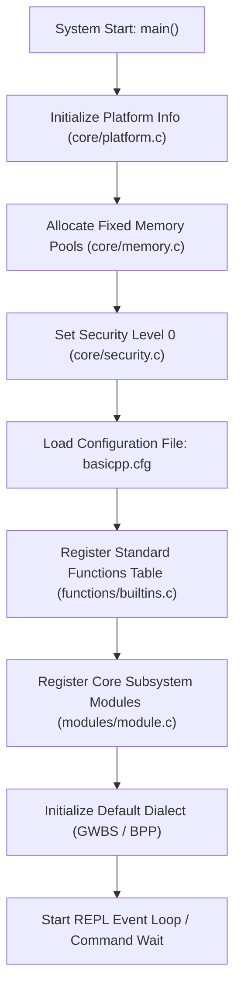
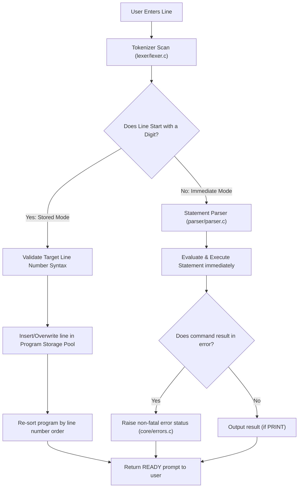
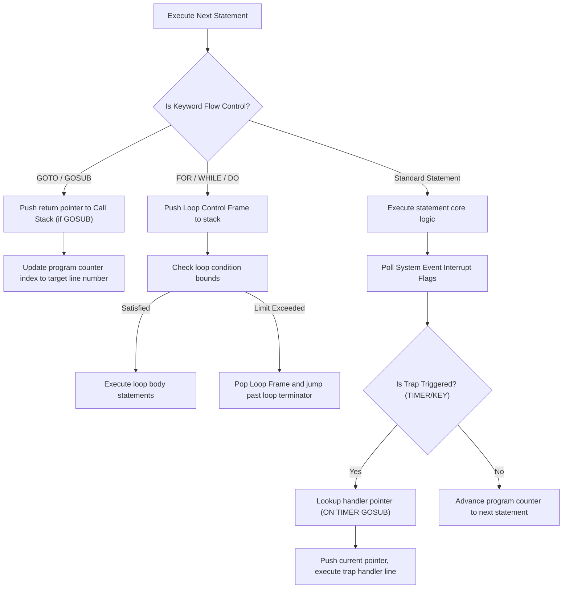
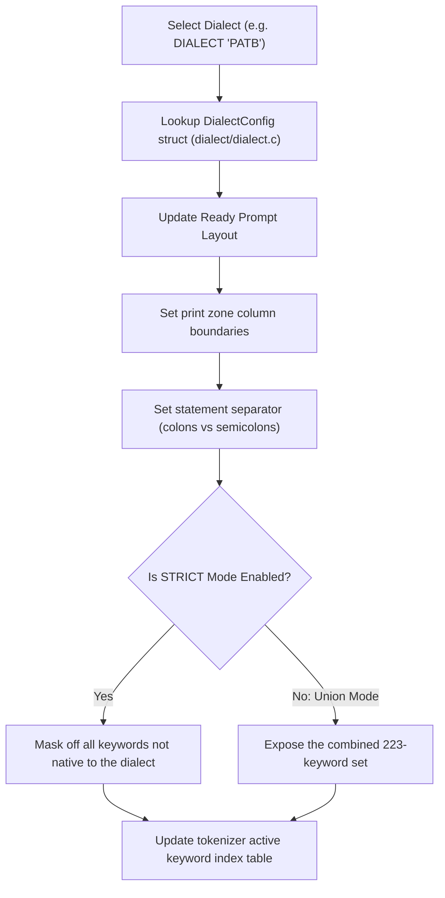
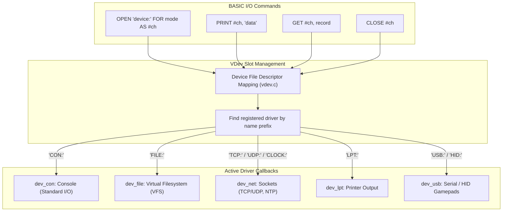
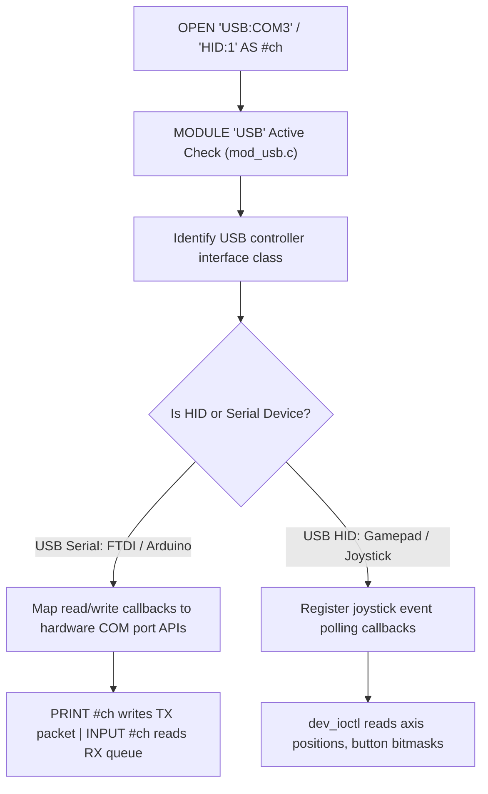
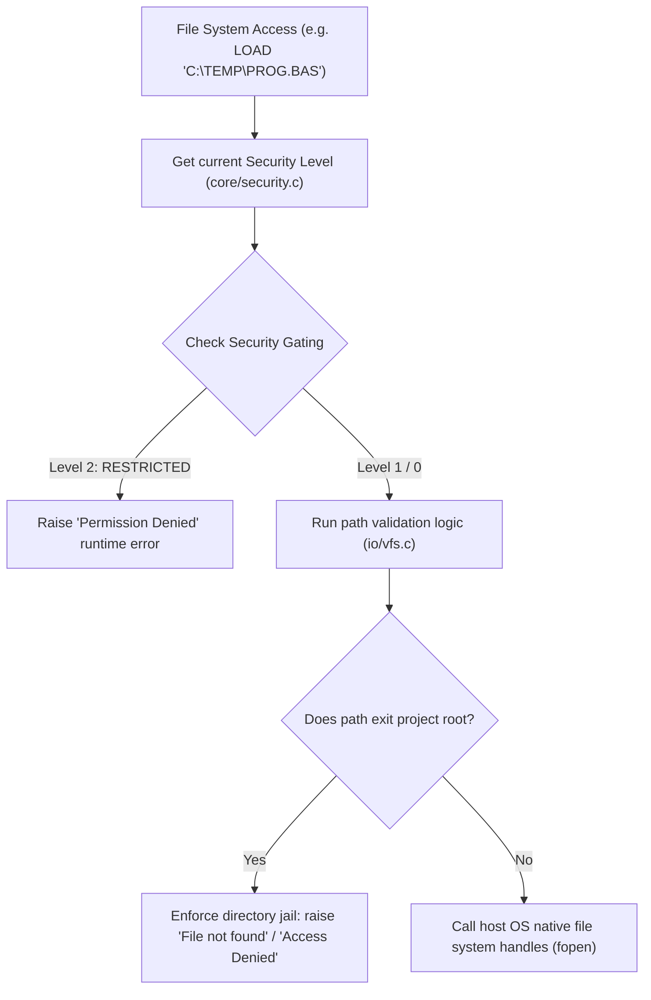
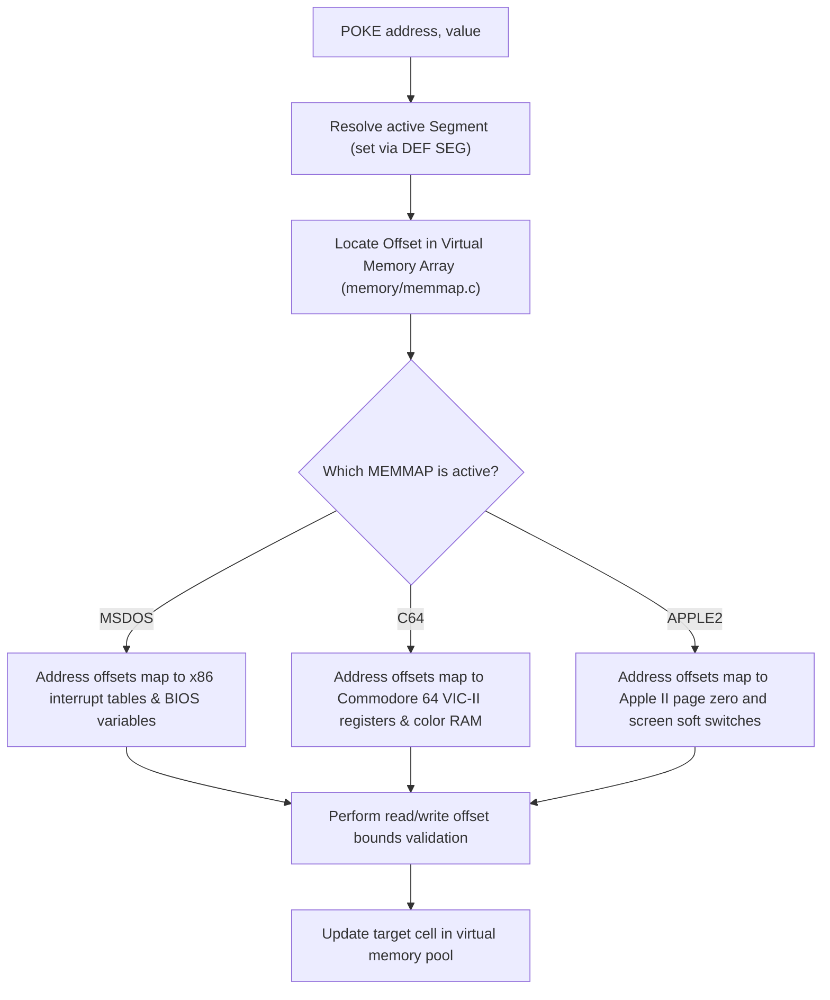
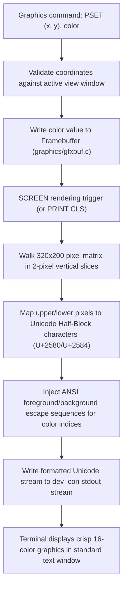

# BASIC++ Architectural Flowcharts & Execution Reference

This document maps out the end-to-end execution flow, state management, virtualization subsystems, and peripheral routing pipelines of the BASIC++ interpreter and compiler.

---

## 1. System Core Overview (User Space vs. System Space)

This diagram shows the structural layers of BASIC++. It maps how a user interacts with the front-end interface, how the interpreter engine processes that interaction, and how the core virtualization layers bridge BASIC code to physical hardware.

```mermaid
graph TD
    subgraph user_view ["What the User Sees"]
        A1["CLI Console Banner / Prompt"]
        A2["Interactive REPL Command Line"]
        A3["Dialect Ready Prompts (Ok, READY, >, &#93; )"]
    end

    subgraph interpreter_view ["What the System Sees"]
        B1["Main Dispatch (core/main.c)"]
        B2["Memory Pools (core/memory.c)"]
        B3["Dialect Configurations (dialect/dialect.c)"]
        B4["Security Sandbox (core/security.c)"]
    end

    subgraph hardware_virtualization ["Virtual Device Layer"]
        C1["VDev Registry (virtual/vdev.c)"]
        C2["VFS Sandboxed Filesystem (io/vfs.c)"]
        C3["MEMMAP Emulated Layouts (memory/memmap.c)"]
        C4["USB & Serial Controllers (modules/mod_usb.c)"]
    end

    A2 -->|Inputs Line| B1
    B1 -->|Allocates State| B2
    B1 -->|Applies Filter| B3
    B1 -->|Gates Access| B4
    B1 -->|Accesses Hardware| C1
    C1 -->|Files| C2
    C1 -->|Memory PEEK/POKE| C3
    C1 -->|USB HID/Serial| C4
```

---

## 2. Boot & Initialization (What the System Sees)

When `basicpp.exe` launches, it bootstraps the system state before opening the REPL loop. This sequence describes the initialization of static memory pools, the loading of configuration directives, and the registry of standard libraries.

---

## 3. Interactive REPL Loop (What the User Sees)

This diagram maps how the interpreter parses, stores, or executes line statements entered by the user in real-time.

---

## 4. Flow Control & Event Trapping

BASIC++ handles program flow structures via nested control frames stored in the execution stack. Hardware interrupts are trapped and handled in-between statements.

---

## 5. Dialect Selection & Feature Gating

BASIC++ supports 16 dialects. It dynamically modifies the parser's active keyword tokens and separators based on the configured profile.

---

## 6. Virtual Device (VDev) Registry & Hardware Routing

The Virtual Device Layer (`VDev`) acts as the driver layer of BASIC++. It maps standard I/O commands to physical drivers.

---

## 7. USB Device Controller & HID Support

The optional USB module interfaces the VDev layer to physical USB serial ports and game controllers.

---

## 8. Virtual Filesystem (VFS) & Sandboxing

All local file interactions are routed through a sandboxed Virtual Filesystem (`VFS`) to enforce path security rules.

---

## 9. Virtual Memory Maps (MEMMAP Presets)

The PEEK/POKE system operates inside a segmented memory model. Setting `MEMMAP` configures virtual memory locations to simulate legacy hardware platforms.

---

## 10. Virtual Terminal, Consoles & Framebuffer

The graphics engine renders color pixel grids to standard text terminals. It maps pixel matrices to Unicode characters.

---

## 11. Maintenance Reference

### What We Can Change
- **Keywords Registry Table**: New keywords or system operations can be registered alphabetically in `functions/builtins.c` and documented in `help/help.c`.
- **Dialect Profiles Definitions**: Dialect-specific constraints (READY prompts, zone widths, separator styles) can be modified inside their respective profiles in the `dialect/` folder.
- **Hardware Drivers Callbacks**: Custom VDev driver mappings (e.g. LCD display devices, sensor drivers) can be registered inside `virtual/vdev.c`.

### What We Cannot Change
- **Core Pool Allocators**: The bump-allocation architecture in `core/memory.c` handles all program statements and variables statically. Modifying its allocator will corrupt variable indexing.
- **Token Index Sequences**: The ordering of token enumerations in `lexer.h` must match the lexical parsing dispatch table logic exactly.
- **RuntimeState Layout**: The `RuntimeState` struct in `runtime.h` contains the active call stacks, file channel indexes, and variable frames. Its structure must remain intact for correct VM operations.

### Troubleshooting
- **Stack Overflow**: If deep recursion in `SUB` or `FUNCTION` blocks causes a crash, increase `MAX_STACK_DEPTH` in `config.h`.
- **String Memory Depletion**: If a long-running string utility crashes with out-of-memory errors, check allocations and call `FRE(0)` to force string pool recycling.
- **Garbled Terminal Display**: If the Unicode framebuffer renders poorly, check that the host shell console is set to UTF-8 mode and supports standard 16-color ANSI escape sequences.
